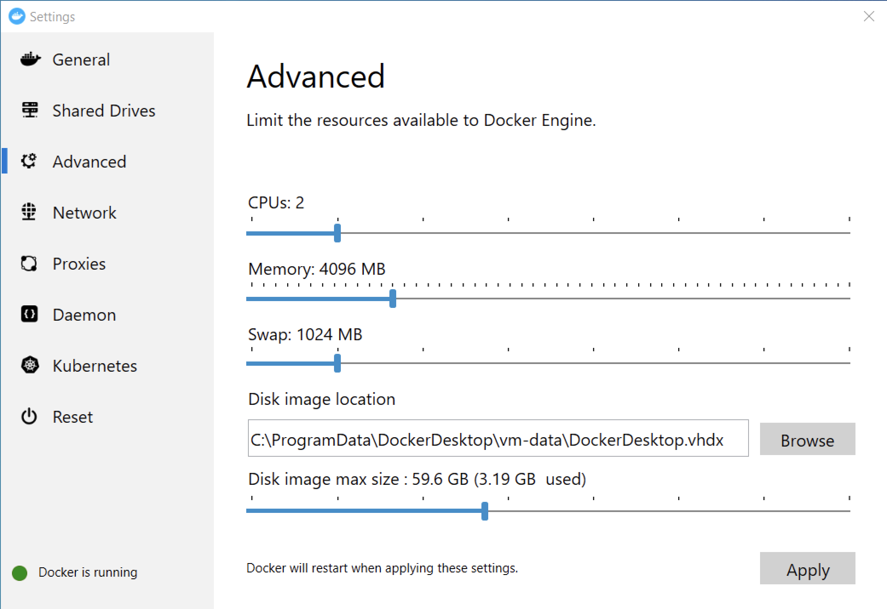
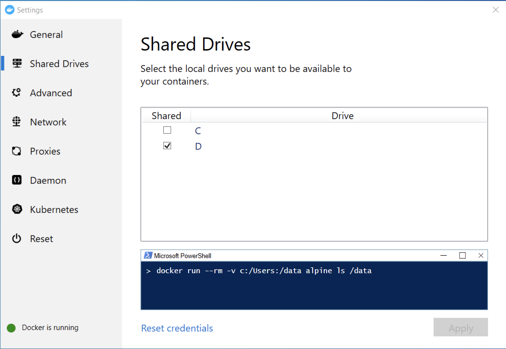

Zebrunner is a central automation reporting system that is built on the top of Java Spring Framework. It dramatically increases the transparency of test automation results and provides better understanding of product quality. Qaprosoft team is developing Zebrunner based on more than 10-years expertise in quality assurance and we strongly believe that your QA/Dev engineers and managers will love it!

<p align="center">
  
</p>

Zebrunner was initially designed to track automation progress of the tests written using [Carina automation framework](https://github.com/qaprosoft/carina/) but you are capable to integrate Zebrunner client into your own automation tool. We are actively developing clients for different languages and frameworks but still looking for active community to provide better support.

#### Primary features
* Real-time test results tracking via websockets
* VNC streaming and video recording of test sessions
* Flexibly configured widgets and dashboards based on [ECharts](https://www.echartsjs.com/en/index.html)
* User management with authorization policies
* Integration with TestRail and JIRA
* Integration with Slack
* Ability to compose automation reports and send via email

<table>
  </tr>
    <td>
      <b>Configurable dashboards</b>
      
    </td>
    <td>
      <b>Integrations with multiple services</b>
      
    </td>
  </tr>
  </tr>
    <td>
      <b>Real-time test results</b>
      
    </td>
    <td>
      <b>Live streaming and video recording</b>
      
    </td>
  </tr>
  </tr>
    <td>
      <b>Comparison of test runs</b>
      
    </td>
    <td>
      <b>Test issues tracking</b>
      
    </td>
  </tr>
</table>

## Installation steps

### Setup with Docker
This is **non-production deployment** that will suite for demo or development purposes.

#### Linux or MacOS
1. Install [Docker Engine](https://docs.docker.com/engine/installation) and [Docker Compose](https://docs.docker.com/compose/install)
2. Configure **vm.max_map_count** kernel setting using official [ES guide](https://www.elastic.co/guide/en/elasticsearch/reference/6.1/docker.html#docker-cli-run-prod-mode)
3. Clone this repo and navigate to the root folder
4. Make sure that the followting ports are not binded by other applications: 

  ```
  80                 (NGINX for UI)
  8080               (API gateway)
  5433               (Postgres)
  5672, 61613, 15672 (RabbitMQ)
  6379               (Redis)
  9200               (Elasticsearch
  ```
5. If you are going to access application from remote host, get the IP of your machine and replace localhost in `Zebrunner-properties.env` with actual IP address
  ```
  ZAFIRA_WEB_HOST=http://localhost:80
  ZAFIRA_API_HOST=http://localhost:8080
  ELASTICSEARCH_URL=http://localhost:9200
  ```
6. Deploy application using `docker-compose`
  ```
  $ docker-compose up -d
  ```
7. Open application in browser:
  ```
  $ http://<HOST_IP>/app
  ```
8. Login to the application with default credentials
  ```
  qpsdemo/qpsdemo
  ```
9. Navigate to http://<HOST_IP>/app/integraions and enable RabbitMQ in Message Broker

  ```
  HOST=<HOST_IP>
  PORT=5672
  USER=qpsdemo
  PASSWORD=qpsdemo
  ```

#### Windows
The steps are pretty identical to the Linux or MacOS, it requires additional tunning of Docker

1.1 Make sure you have allocated at least 2CPU and 4GB of RAM for Docker (via Docker settings)
<p align="center">
  
</p>

1.2 Make sure that you enabled drive sharing for Docker
<p align="center">
  
</p>

1.3 Create volumes

  ```
  $ docker volume create --name=pgdata
  $ docker volume create --name=esdata
  ```
  
6. Deploy application using `docker-compose`

  ```
  $ docker-compose -f docker-compose-win.yml up -d
  ```

### Production deployment
If you are looking for production-ready solution to deploy in your own private cloud please see [QPS Infra](https://github.com/qaprosoft/qps-infra). Zebrunner is also offered as a managed Cloud service - see [zebrunner.com](https://zebrunner.com). For more info and help do not hesitate to contact us via support channels listed at the bottom of this document.


## Building Zebrunner image(s) from sources
Alternatively, if you'd like to play around with Zebrunner codebase and/or contribute to our project you might need to spin up images built from source code vs ones pulled from Docker Registry. In order to do so:
1. Once you'll update the code make sure to re-package the `.jar` file by executing following command from `sources` directory:
    ```
    ./gradlew clean build
    ```
    Bundled archive can be found inside `/sources/zafira-ws/build/libs` directory.
2. Go to `docker-compose.yml` and make sure that instead of image reference target service you want to build from sources contains a `build` instruction:
    ```yml
    Zebrunner:
      container_name: zfr_zafira_back_end
      # image: qaprosoft/zafira:4.1.69
      build: .
    ```
    It will tell Docker Compose to look for Dokerfile in current directory and delegate image contruction process to Docker vs pulling the image from Registry.
3. Run the following command to start Zebrunner:
    ```
    docker-compose up -d --build
    ```
    `--build` instruction will tell Docker Compose to force rebuild container rather than use the one residing on your filesystem (if this is not your first Zebrunner run).
    That's it, go ahead and give applicaion a try!

### Application configuration and sensitive parameters
As you might have notice already, Zebrunner comes with a pre-defined configuration so you have all the features enabled out-of-the-box. However, if you'd like to use Zebrunner in production you'll definetely need to tweak a few things.
Complete list of Zebrunner runtime configuration parameters can be seen in `Zebrunner-properties.env` file. Parameter names are self-explanatory, so it shouldn't be a problem to figure out what's what: file contains both application-specific, and settings that are common for many applications out there (such as datasource, message broker, cache configuration, etc).
However there are a few things to pay attention to:
1. **Application URL and REST API url**
    `Zebrunner_WEB_HOST=` should point to host machine, where front-end application is deployed
    `Zebrunner_API_HOST=` should point to host machine, where back-end (or ELB sitting in front of it) application is deployed
2. **Secrets: crypto salt and auth token**
    `AUTH_TOKEN_SECRET=` value is a signature verification key that is used to validate any discovered JWS digital signatures and thus should not be set to default one. Note: It should be **randomized base64 encoded** string
    `CRYPTO_SALT=` value is by application for encryption of sensitive settings (such as passwords, integration settings, etc) and thus should not be set to default one. Note: It should be randomized alpha-numeric string.

Please note, that we do not provide on-premise production deployment guide for Zebrunner. However, if that is something you might be interested in, go ahead and check out our own [QPS-Infra](https://www.qps-infra.io) at https://www.qps-infra.io.
Wanna jump straight to testing with Zebrunner skipping all of the deployment and maintenance hassle? Check out [Zebrunner](https://zebrunner.com), Cloud-native version of Zebrunner at https://zebrunner.com.

## Integration

Regardless of Zebrunner client language you have to generate **Zebrunner_access_token** first, to do that navigate to **Username** > **My profile** in top menu and generate new access token.


#### Languages and frameworks supported
* [Java - TestNG guide](https://github.com/qaprosoft/Zebrunner-testng)
* [Ruby - Cucumber](https://github.com/qaprosoft/Zebrunner-ruby#cucumber-usage)
* [Ruby - RSpec](https://github.com/qaprosoft/Zebrunner-ruby#rspec-usage)
* [C# - NUnit](https://github.com/qaprosoft/Zebrunner-nunit)

## Documentation support
* [User manual](http://qaprosoft.github.io/Zebrunner)
* [Demo project](https://github.com/qaprosoft/carina-demo)
* [Telegram channel](https://t.me/qps_Zebrunner)
* [On-premise Zebrunner deployment with QPS-Infra](https://www.qps-infra.io)
* [Zebrunner: Cloud-native Zebrunner](https://zebrunner.com)

## License
Code - [Apache Software License v2.0](http://www.apache.org/licenses/LICENSE-2.0)

Documentation and Site - [Creative Commons Attribution 4.0 International License](http://creativecommons.org/licenses/by/4.0/deed.en_US)
