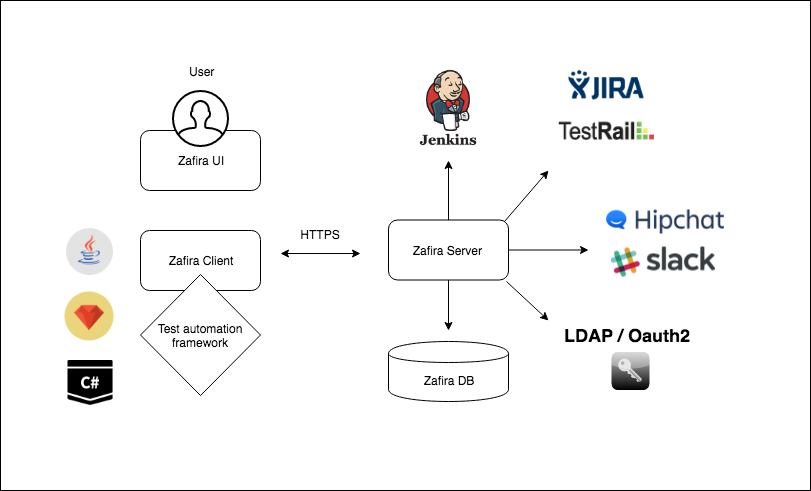
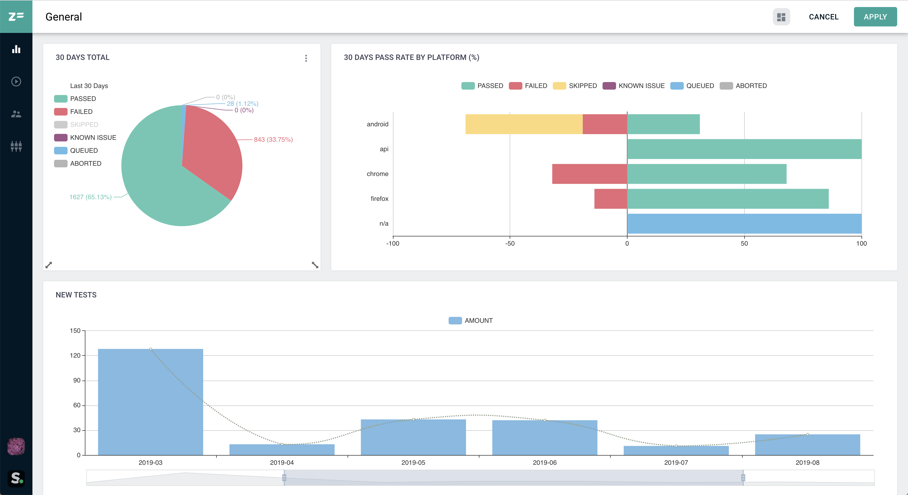
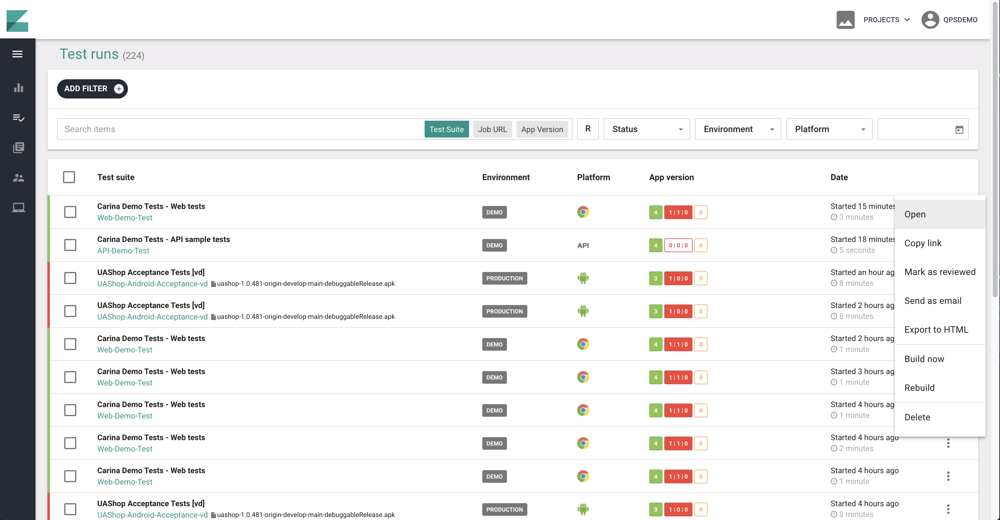
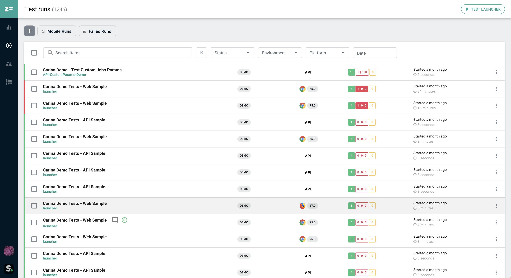
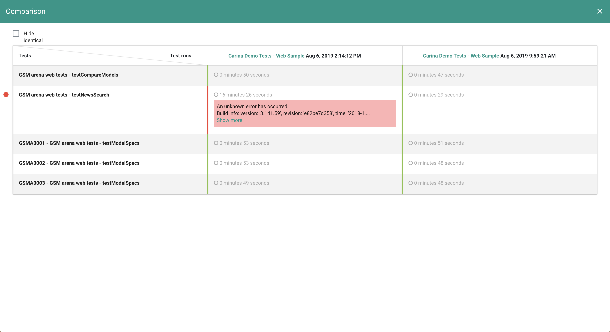
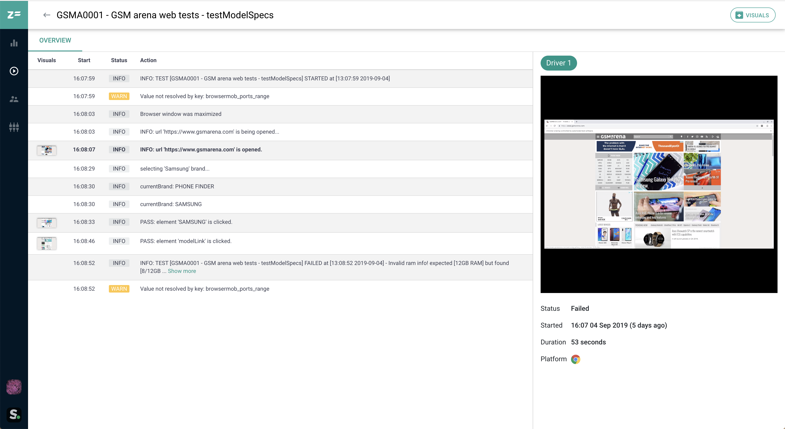
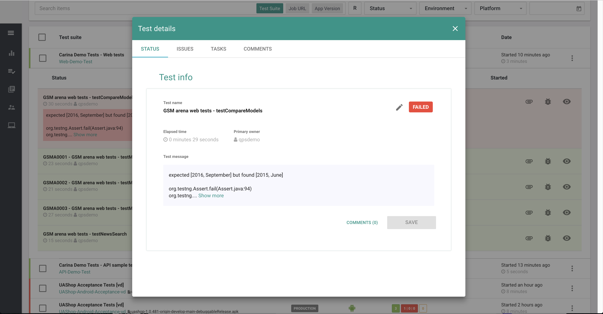
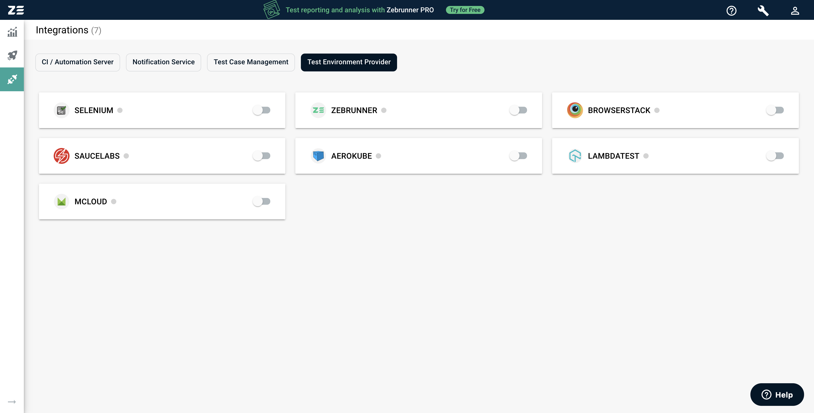
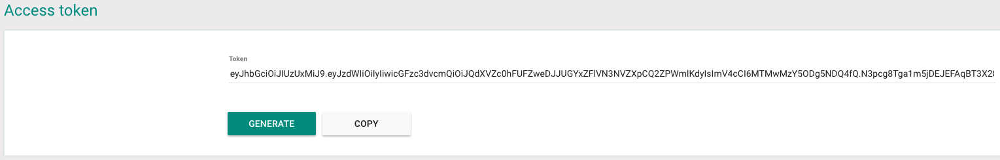

==================

Zafira is central automation reporting system that is build on the top of Java Spring Framework. It dramatically increases the transparany of test automation results and provides better undestanding of product quality. Qaprosoft team is developing Zafira based on more then 10-years expertise in quality assurance and we strongly believe that your QA/Dev engineers and managers will love it!


#### Primary features
* Real-time test results tracking via websockets
* VNC streaming and video recording of test sessions
* Flexibly configured widgets and dashboards based on [D3JS](https://d3js.org/)
* User management with authorization policies
* Integration with TestRail and JIRA
* Integration with Hipchat and Slack
* Ability to compose automation reports and send via email


Zafira was initially designed to track automation progress of the tests written using [Carina automation framework](https://github.com/qaprosoft/carina/) but you are capable to integrate Zafira client into you own automation tool. We are activly developing clients for different languages and frameworks but still looking for active community to provide better support. 

#### Languages and frameworks supported
* [Java - TestNG guide](https://github.com/qaprosoft/zafira-testng)
* [Ruby - Cucumber](https://github.com/qaprosoft/zafira-ruby#cucumber-usage)
* [Ruby - RSpec](https://github.com/qaprosoft/zafira-ruby#rspec-usage)
* [C# - NUnit](https://github.com/qaprosoft/zafira-nunit)


Zafira is Java-based web application that accumulates test automation results and increases the transparency of QA automation process. [D3JS](https://d3js.org)-based widgets with high flexibility of configuration allows to represent test results in different ways according to your companies processes.



## Features

#### Configurable dashboards based on [D3JS](https://d3js.org/)


#### Test runs management


#### Real-time test results


#### Comparison of test runs


#### Live streaming and video recording of test sessions


#### Test issues tracking


#### Integrations with multiple services


## Installation steps

#### Simple set with Docker

1. Install [Docker](https://docs.docker.com/engine/installation/) ([Engine](https://docs.docker.com/engine/installation/), [Compose](https://docs.docker.com/compose/install/))
2. Clone current repo and navigate to the repo root on your local machine
  ```
3. Deploy Zafira using `docker-compose` within the same folder

  ```Shell
  $ docker-compose up
  ```
To start Zafira in daemon mode, add '-d' argument:
  ```Shell
  $ docker-compose up -d
  ```  
4. Open in your browser IP address of deployed enviroment at port `8080`

  ```
  $ http://localhost:8080/zafira
  ```
5. Use next login/pass for access: `qpsdemo/qpsdemo`.

## Integration

Regardless of Zafira client language you have to generate **zafira_access_token** first, to do that navigate to **Username** > **My profile** in top menu and generate new access token.




## License
Code - [Apache Software License v2.0](http://www.apache.org/licenses/LICENSE-2.0)

Documentation and Site - [Creative Commons Attribution 4.0 International License](http://creativecommons.org/licenses/by/4.0/deed.en_US)
