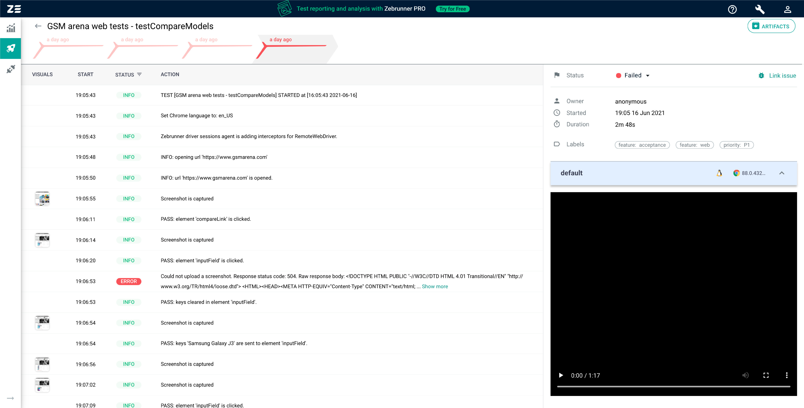
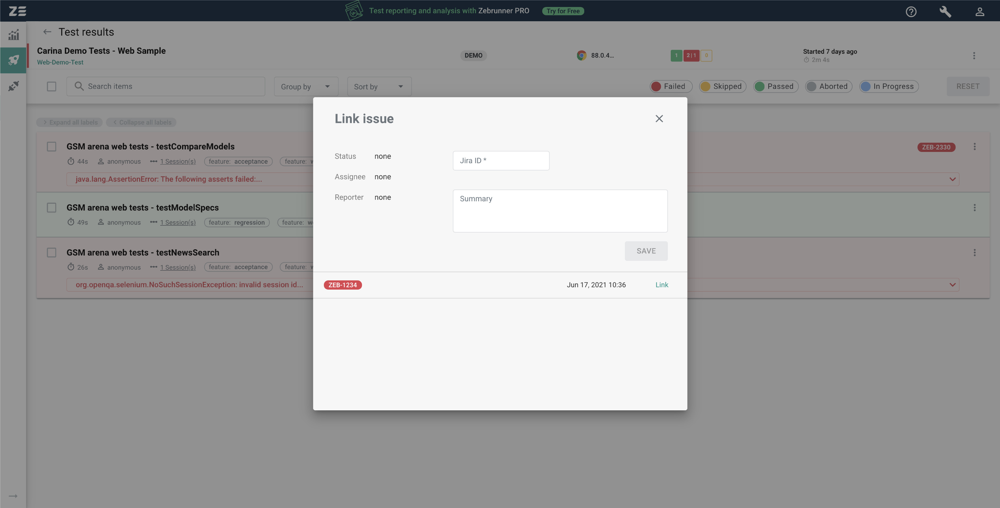

<p style="padding: 10px;" align="left">
  
</p>

Zebrunner Reporting is a test automation management tool that accumulates and represents test results. It is designed to increase the transparency of automation, providing detailed reports with test logs, screenshots and video recordings of test sessions. Detailed reporting functionality reduces maintenance work for automation teams, allowing to identify application bugs and fix them earlier in the release cycle.

Enjoy using Zebrunner Reporting in your testing process!

Feel free to support the development with a [**donation**](https://www.paypal.com/donate?hosted_button_id=JLQ4U468TWQPS) for future improvements.

<p align="center">
  <a href="https://zebrunner.com/"></a>
</p>

**Zebrunner Insights** - premium reporting features for your tests. See test results in real time - Zebrunner records interactive video sessions, publishes logs and screenshots. Track your pass rate, infrastructure usage, and automation team performance in one application.

**Zebrunner Guard** - your data and users will be safe with our enterprise-grade security and centralized administration. Due to the flexible permission management, you can limit access to certain information and keep the workflow steady.

## Core features
* Real-time test results tracking via websockets
* VNC streaming and video recording of test sessions
* Flexibly configured widgets and dashboards
* User management with authorization policies
* Integration with TestRail and JIRA
* Integration with Slack
* Ability to compose automation reports and send via email

<table>
  <tr>
    <td>
      <b>Configurable dashboards</b>
      
    </td>
    <td>
      <b>Integrations with multiple services</b>
      
    </td>
  </tr>
  <tr>
    <td>
      <b>Real-time test results</b>
      
    </td>
    <td>
      <b>Live streaming and video recording</b>
      
    </td>
  </tr>
  <tr>
    <td>
      <b>Test issues tracking</b>
      
    </td>
  </tr>
</table>

## Repositories structure

Zebrunner Reporting **server side** consists of the following modules:
- [`reporting-service`](https://gitlab.com/zebrunner/ce/reporting-service) application backend
- [`reporting-ui`](https://gitlab.com/zebrunner/ce/reporting-ui) application frontend


Zebrunner Reporting **client side** repositories:
- [`java-agent-core`](https://github.com/zebrunner/java-agent-core) agent library core (Java)
- [`java-agent-testng`](https://github.com/zebrunner/java-agent-testng) official TestNG agent
- [`java-agent-junit`](https://github.com/zebrunner/java-agent-junit) official JUnit agent
- [`java-agent-junit5`](https://github.com/zebrunner/java-agent-junit5) official JUnit 5 agent


#  Prerequisites

## Hardware requirements

|                         | Requirements                                                    	                |
|:-----------------------:| ----------------------------------------------------------------------------------|
| <b>Operating System</b> | Linux Ubuntu 16.04, 18.04, 20.04<br> Linux CentOS 7+<br> Amazon Linux 2           |
| <b>       CPU      </b> | 4+ Cores                                                         	                |
| <b>      Memory    </b> | 16Gb RAM                                                            	            |
| <b>    Free space  </b> | SSD 64Gb+ of free space                                         	                |

## Installation steps

1. Install [Docker Engine](https://docs.docker.com/engine/installation) and [Docker Compose](https://docs.docker.com/compose/install).
2. Clone this repo recursively and navigate to the root folder:
  ```
  git clone --recurse-submodule https://github.com/zebrunner/reporting.git && cd reporting
  ```
4. Run the application:
  ```
  ./zebrunner.sh start
  ```
5. Login to the application with default credentials **admin**/**changeit**:
  ```
  $ http://localhost:8081/
  ```

## Community and support
* [Telegram channel](https://t.me/zebrunner)
* [User guide](https://zebrunner.com/documentation)
* [On-premise deployment with Zebrunner CE](https://zebrunner.github.io/zebrunner/)
* [Zebrunner PRO](https://zebrunner.com)

## License
Code - [Apache Software License v2.0](http://www.apache.org/licenses/LICENSE-2.0)
