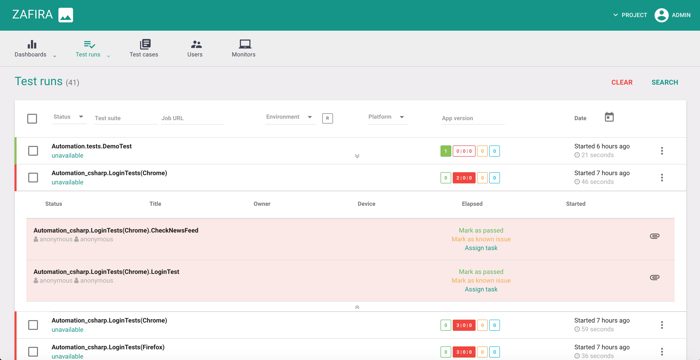
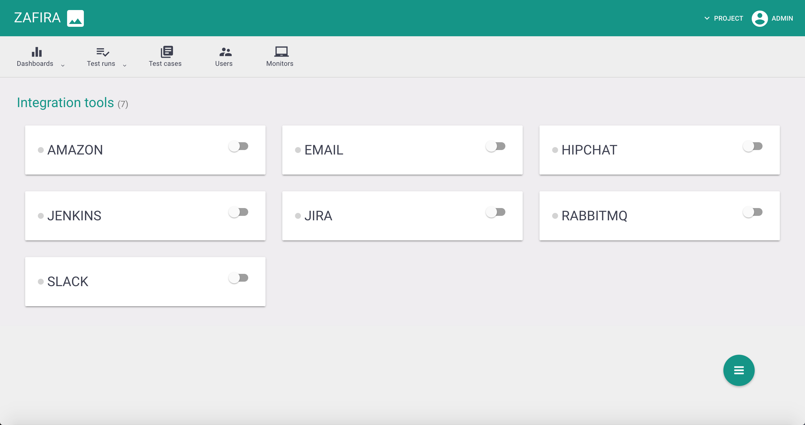

## Zafira QA Automation Reporting

Zafira is a Web application that collects test results from QA automation.

Configurable dashboards based on [D3JS](https://d3js.org/)


Real-time test results


Integrations with multiple services


## Installation steps

#### Simple set with Docker

1. Install [Docker](https://docs.docker.com/engine/installation/) ([Engine](https://docs.docker.com/engine/installation/), [Compose](https://docs.docker.com/compose/install/))
2. Download [Example of compose descriptor](https://raw.githubusercontent.com/qaprosoft/zafira/master/docker-compose.yml) to any folder

  ```Shell
  $ curl https://raw.githubusercontent.com/qaprosoft/zafira/master/docker-compose.yml -o docker-compose.yml
  ```
3. Deploy Zafira using `docker-compose` within the same folder

  ```Shell
  $ docker-compose up
  ```
To start Zafira in daemon mode, add '-d' argument:
  ```Shell
  $ docker-compose up -d
  ```  
4. Open in your browser IP address of deployed enviroment at port `8080`

  ```
  $ http://localhost:8080/zafira
  ```
5. Use next login/pass for access: `qpsdemo/qpsdemo`.

## Integration

[Java sample](https://github.com/qaprosoft/carina-demo)

## License
Code - [Apache Software License v2.0](http://www.apache.org/licenses/LICENSE-2.0)

Documentation and Site - [Creative Commons Attribution 4.0 International License](http://creativecommons.org/licenses/by/4.0/deed.en_US)
