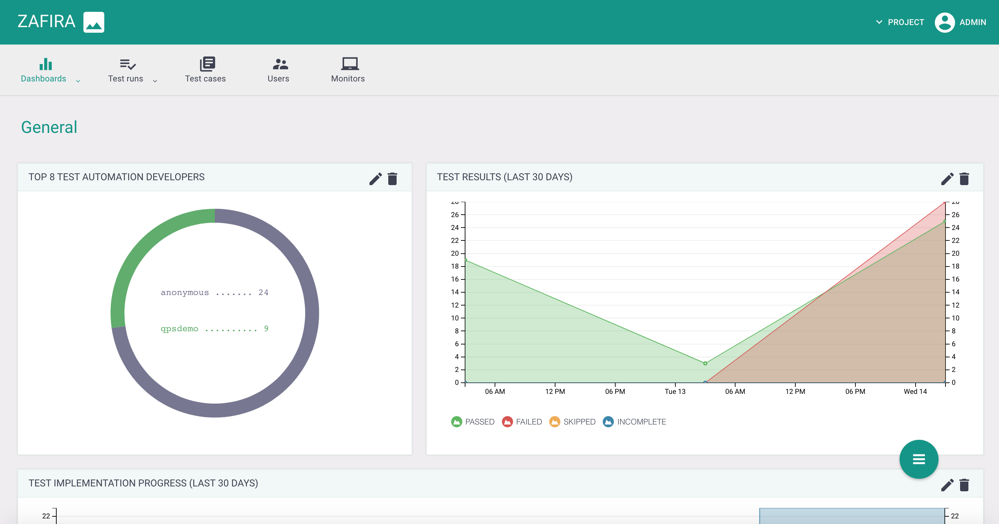
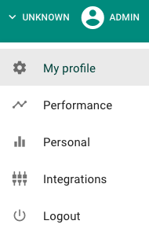

Zafira
==================

Zafira is Java-based web application that accumulates test automation results and increases the transparency of QA automation process. [D3JS](https://d3js.org)-based widgets with high flexibility of configuration allows to represent test results in different ways according to your companies processes.


## Features

### Configurable dashboards based on [D3JS](https://d3js.org/)


### Real-time test results


### Integrations with multiple services


## Installation steps

#### Simple set with Docker

1. Install [Docker](https://docs.docker.com/engine/installation/) ([Engine](https://docs.docker.com/engine/installation/), [Compose](https://docs.docker.com/compose/install/))
2. Download [Example of compose descriptor](https://raw.githubusercontent.com/qaprosoft/zafira/master/docker-compose.yml) and [Example of integrations](https://raw.githubusercontent.com/qaprosoft/zafira/master/integrations.env) to any folder

  ```Shell
  $ curl https://raw.githubusercontent.com/qaprosoft/zafira/master/docker-compose.yml -o docker-compose.yml
  $ curl https://raw.githubusercontent.com/qaprosoft/zafira/master/integrations.env -o integrations.env
  ```
3. Deploy Zafira using `docker-compose` within the same folder

  ```Shell
  $ docker-compose up
  ```
To start Zafira in daemon mode, add '-d' argument:
  ```Shell
  $ docker-compose up -d
  ```  
4. Open in your browser IP address of deployed enviroment at port `8080`

  ```
  $ http://localhost:8080/zafira
  ```
5. Use next login/pass for access: `qpsdemo/qpsdemo`.

## Integration

To integrate Zafira either with your own Java-based application or with [Java sample project](https://github.com/qaprosoft/carina-demo) use [zafira.properties](zafira_sample.properties) file.

**For [sample project](https://github.com/qaprosoft/carina-demo):**

1. Set value *zafira_access_token* in **zafira.properties** file in resources folder.

To get token value:

- Navigate to User Menu and open User Profile page in Zafira



- Generate and copy access token


**For custom Java-based project:**

1. Put **zafira.properties** file in a *resources* folder.

2. Set properties parameters:

  - *zafira_enabled* - enabling/disabling writing tests into Zafira
  - *zafira_service_url* - zafira web services URL
  - *zafira_access_token* - steps for token generation are given above
  - *zafira_project* - your project name

   The other parameters are optional.

 3. Make sure that ZafiraListener is configured in one of the following ways:

 - testNG xml configuration

 - listener class annotation

 - maven surefire plugin property


## License
Code - [Apache Software License v2.0](http://www.apache.org/licenses/LICENSE-2.0)

Documentation and Site - [Creative Commons Attribution 4.0 International License](http://creativecommons.org/licenses/by/4.0/deed.en_US)
