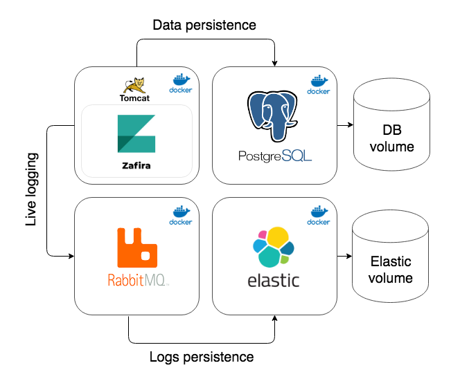

# Getting started

#### Docker setup
The easiest way to deploy Zafira it to use [Docker](https://docs.docker.com/). You will find all the details for installation of [Docker Engine](https://docs.docker.com/install/) and [Docker Compose](https://docs.docker.com/compose/install/) in oficial documentation. Docker allows to install Zafira on Linux, Mac or Windows. 

Verify Docker Engine setup:
 ```
$ docker version

Client:
 Version:      18.05.0-ce
 ...

Server:
 Engine:
  Version:      18.05.0-ce
  ...
```
Verify Docker Compose setup:
```
$ docker-compose version
 
docker-compose version 1.21.2, build a133471
docker-py version: 3.3.0
 ```
 
 #### Zafira startup using Docker

<p align="center">
  
</p>
