# Integration

Zafira is integrated with multiple third-party tools such as Amazon, Slack, Gmail, etc. You can add new integration to a working Zafira without having to restart the web application. Navigate to the ** Integrations ** icon in the sidebar menu:

<p align="center">
  
</p>

On the Integrations page, you will find several blocks responsible for different integration modules. Please note that the HTTP / HTTPS security model may affect your integration URL.

<p align="center">
  
</p>


#### Amazon
Zafira uses integration with Amazon S3 service to store user profile photos and company logo. First of all we will need to create new S3 bucket and generate access token to provide API access to Amazon S3 from Zafira.

* Create new S3 bucket in region you prefer
* Navigate to bucket permissions, CORS configuration and set following policy:
```
<?xml version="1.0" encoding="UTF-8"?>
<CORSConfiguration xmlns="http://s3.amazonaws.com/doc/2006-03-01/">
<CORSRule>
    <AllowedOrigin>*</AllowedOrigin>
    <AllowedMethod>GET</AllowedMethod>
    <AllowedMethod>POST</AllowedMethod>
    <MaxAgeSeconds>3000</MaxAgeSeconds>
    <AllowedHeader>*</AllowedHeader>
</CORSRule>
</CORSConfiguration>
```
* Create new IAM user with **Programmatic access**
* Grant read / write permissions for the new user (see [Detailed Guide] (https://aws.amazon.com/blogs/security/writing-iam-policies-how-to-grant-access-to-an-amazon-s3-bucket))
* Generate new access / secret keys.
* Enable Amazon integration and provide access / secret keys and the name of the bucket you created.
* Click save, a green light indicates the correct integration status.

<p>
  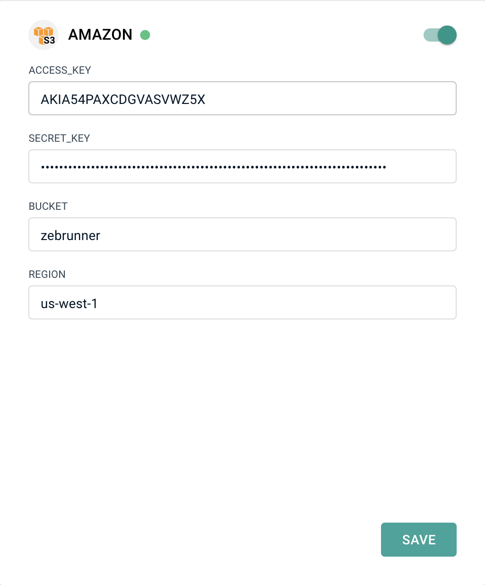
</p>


#### Email
Zafira provides functionality for sending test results, widgets, and dashboards via email. You must provide correct SMTP credentials to enable this feature. We mainly use Gmail for these purposes. You can use the configuration below by replacing your email address and password with valid Gmail credentials.

User invitations and *Forgot password* feature also require SMTP integration.

* Enable email integration.
* Specify the correct SMTP host and port.
* Provide valid Gmail credentials.
* Click save, a green light indicates the correct integration status.

<p>
  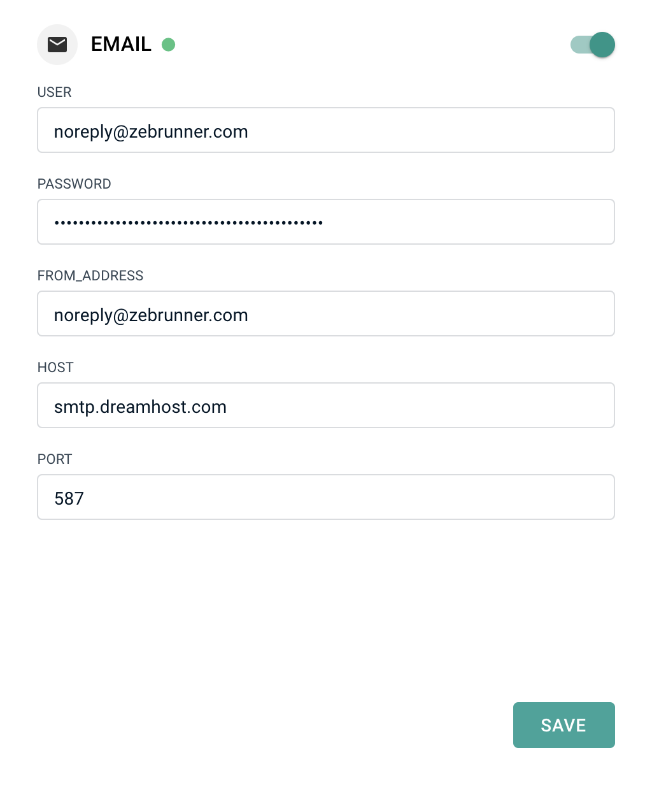
</p>


#### Jenkins
Jenkins integration is used for launching new builds and collecting test jobs configurations during the startup. Zafira also provides remote debugging and launcher functionality with Jenkins integration enabled. To integrate Jenkins, follow these steps:

* Create new user with READ, RUN access for jobs.
* Create an access token (see [instruction] (https://support.cloudbees.com/hc/en-us/articles/115003090592-How-to-re-generate-my-Jenkins-user-token)).
* Paste Jenkins URL, username and token to Zafira.
* Click save, a green light indicates the correct integration status.

<p>
  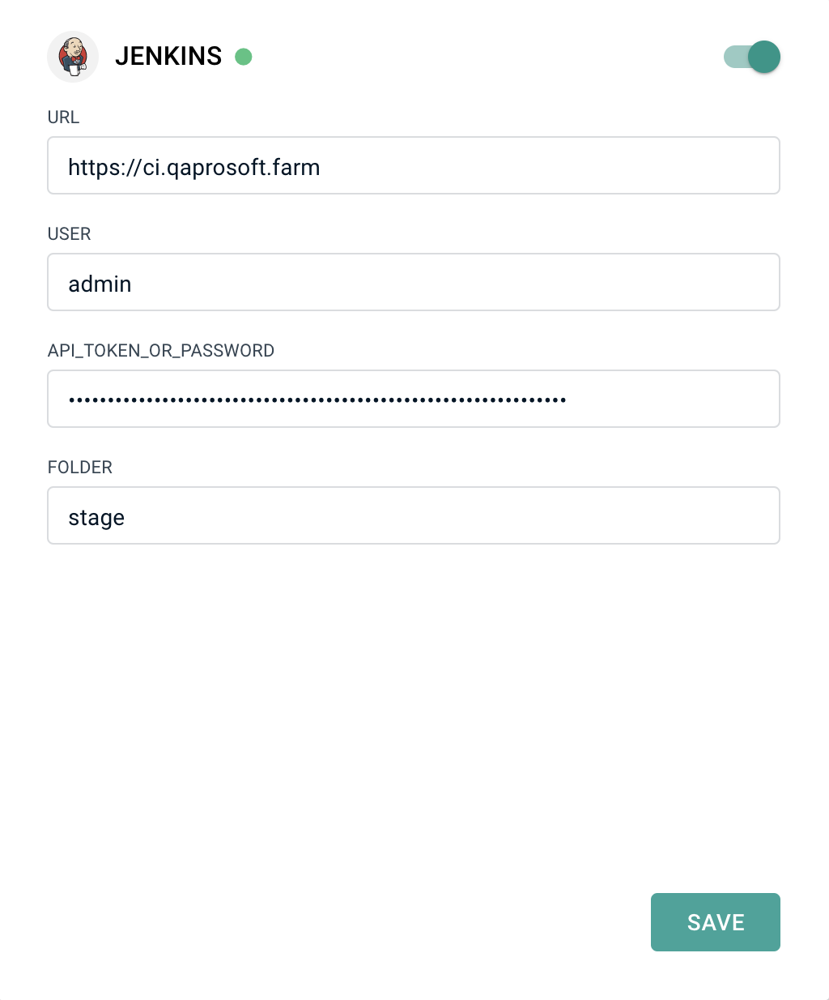
</p>


#### Jira
Jira integration allows you to track known issue status for the failed test cases. When you assign a known issue to constantly failing test cases, you can specify the appropriate Jira ticket. If integration with Jira is enabled, Zafira will check the current ticket status and track the failure as a known issue if the ticket is opened, and as unknown if it is closed, so you will never lose regression bugs.

* Paste Jira URL, username and password to Zafira.
* List a set of statuses that indicates that the ticket is closed.
* Click save, a green light indicates the correct integration status.

<p>
  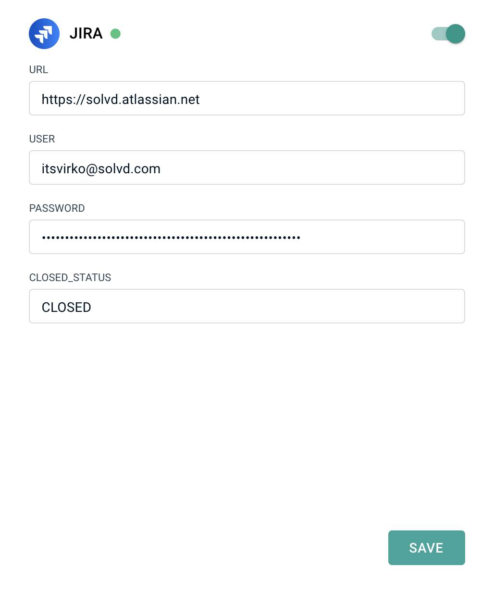
</p>


#### LDAP
Zafira supports LDAP authentication: the first time you successfully log in using LDAP, Zafira will register user data in its own database. The admin will be able to manage user permissions for each new user who comes via LDAP.

* Use configuration below as a reference for your LDAP connection setup
* Click save, a green light indicates the correct integration status

<p>
  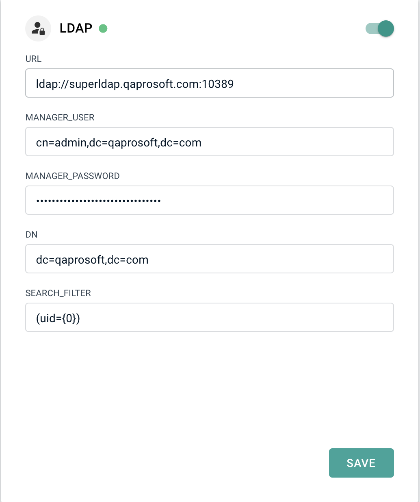
</p>


#### SLACK
Zafira is capable to post automation results into specific Slack channels for better visibility.
If integration is set up correctly after test run is finished notification with run details will be sent into appropriate channel. Such  Slack notification contains base information on test run and also includes links to this run in Zafira and Jenkins.
After user marks some run as reviewed and Slack integration is configured for executed Jenkins job user will be proposed to send to Slack notification about reviewed run.
In order to setup Slack integration follow the next steps:

* Generate Slack web hook url and add it as parameter SLACK_WEB_HOOK_URL into SLACK block at Zafira integrations page.
* Click save, a green light indicates the correct integration status.

<p>
  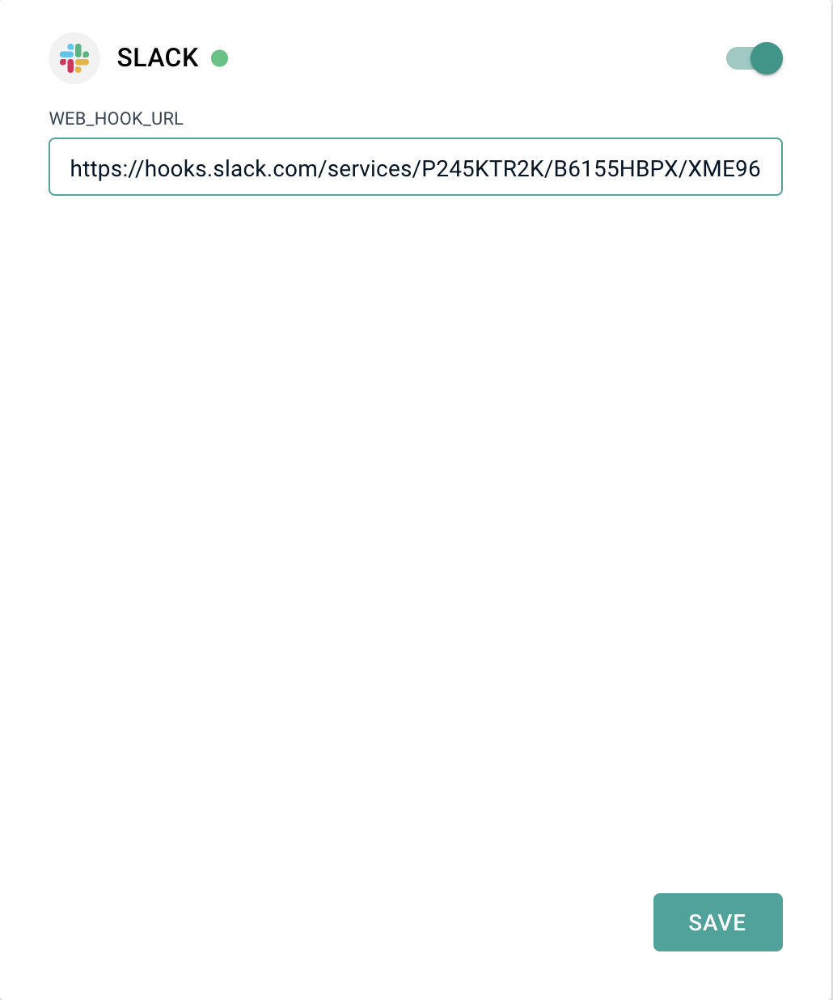
</p>


#### GOOGLE
Integration with Google provides the ability to export test run results to spreadsheets.
It also allows you to use client-side spreadsheet data using temporary credentials provided by Zafira API (GET: /api/settings/google/creds).

To set up integration with Google, follow these steps:

* Generate Google service account key (as a file) and attach it by clicking the UPLOAD CLIENT SECRET ORIGIN button in GOOGLE block on Zafira integrations page.
* Click *Upload*, a green light indicates the correct integration status

<p>
  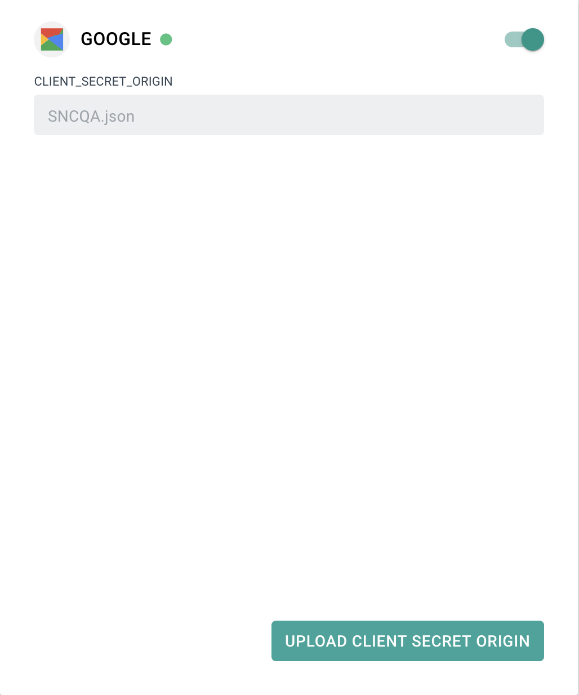
</p>


#### RABBITMQ
RabbitMQ integration is used to provide Zafira with the ability to display test logs. Integration is the gateway to transferring logs to Zafira.
Follow these steps to configure RabbitMQ integration:

* Enable RabbitMQ integration.
* Specify the correct host and port.
* Provide valid credentials.
* Click save, a green light indicates the correct integration status.

<p>
  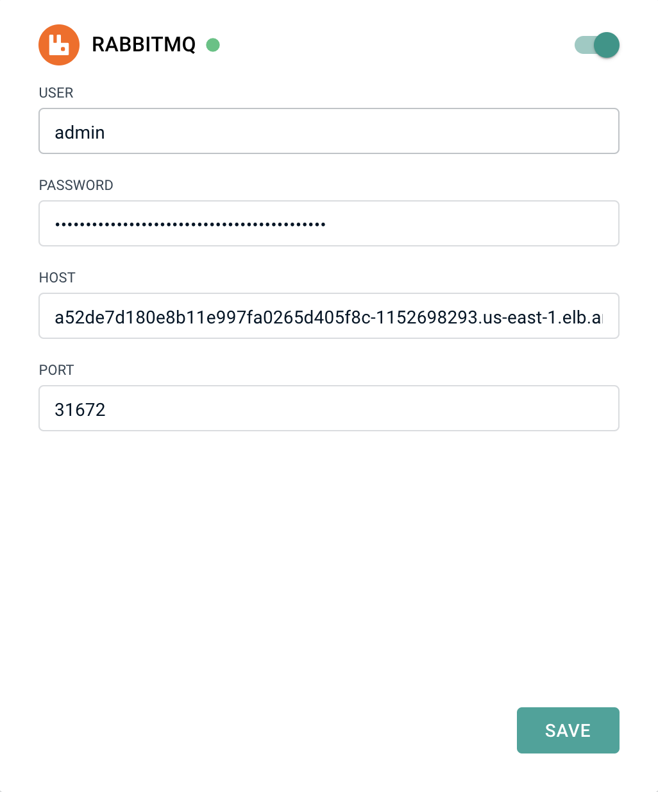
</p>


#### SELENIUM
Zafira uses Selenium integration in the launcher functionality scope.
It provides Selenium server URL used by Jenkins to determine which Selenium instance is preferred for tests launch.
To configure Selenium integration, follow these steps:

* Enable Selenium Integration.
* Enter a valid URL.
* Provide valid credentials if necessary.
* Click save, a green light indicates the correct integration status.

<p>
  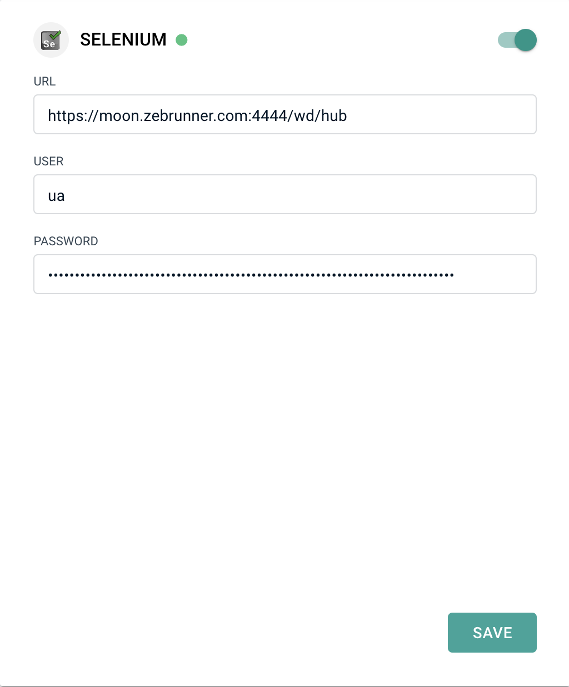
</p>


#### TESTRAIL
TestRail integration is used to build links leading to TestRail test cases from Zafira test tags.
The provided tag key must be TESTRAIL_TESTCASE_UUID as a key, and the internal Testrail test case identifier as a value (for example, 34-66-45465, where 34 - TestRail project ID, 66 - TestRail test suite, 45465 - TestRail test case ID).
To configure TestRail integration, follow these steps:

* Add the TestRail service URL as the parameter URL to the TESTRAIL block on Zafira integrations page.
* Click save, a green light indicates the correct integration status.

<p>
  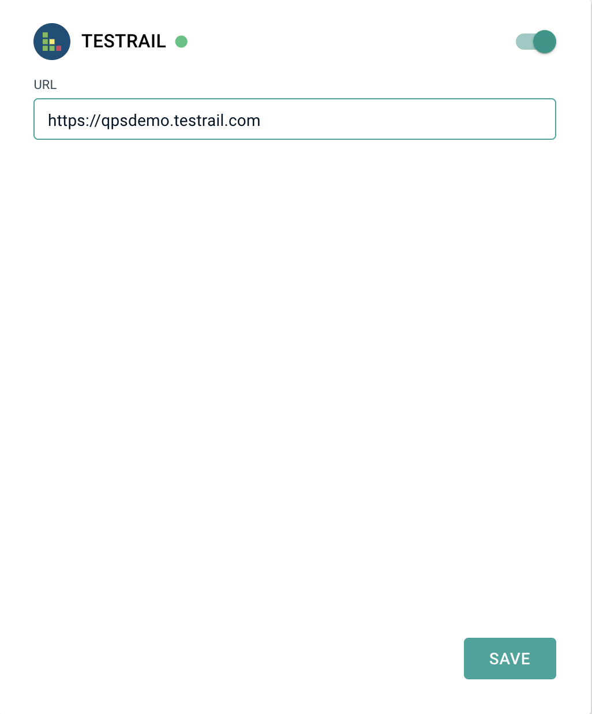
</p>


#### QTEST
Zafira supports integration with qTest to build links leading to qTest test cases from Zafira test tags.
Provided tag key must be QTEST_TESTCASE_UUID, the value is the internal qTest test case identifier (for example, 454-2423, where 454 - qTest project ID, 2423 - qTest test case ID).
To configure qTest integration follow these steps:

* Add qTest service URL as the parameter URL to the QTEST block on Zafira integrations page.
* Click save, a green light indicates the correct integration status.

<p>
  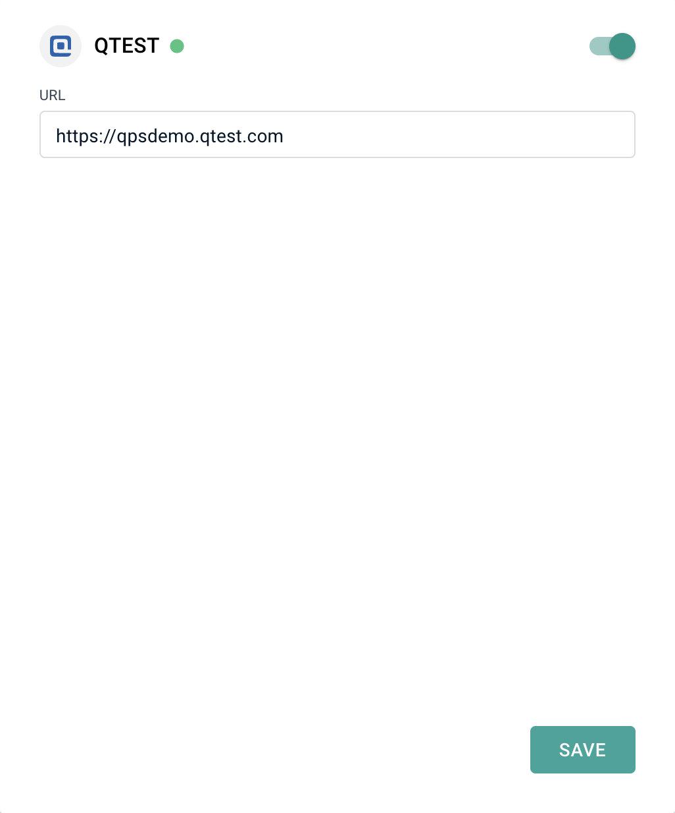
</p>
