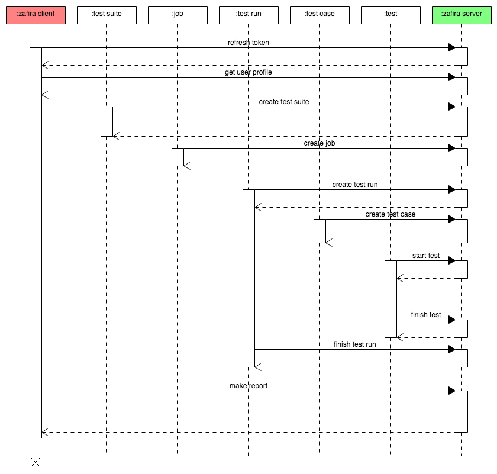

# Lifecycle

Schema below illustrates general test run flow that should be followed for new listeners implmentation:
<p align="center">
  
</p>

---

### Step 1: Refresh token

**POST: /zafira-ws/api/auth/refresh**

**Request**
```json
{
  "refreshToken": "eyJhbGciOiJIUzUxMiJ9..."
}
```
|Field|Datatype|Description|
|:---:|:------:|:---------:|
|refreshToken|String|token obtained by generation|

**Response**
```json
{
  "type": "Bearer",
  "accessToken": "eyJhbGciOiJIUzUMiJ9...",
  "refreshToken": "eyJhbGciOiJIUzUxMi...",
  "expiresIn": 300,
  "tenant": "zafira"
}
```
|Field   | Datatype |  Description |
|:--------:|:----------:|:----------:|
|type| String   | Type of authorization |
|accessToken| String   |  Refreshed token we need for headers |
|expiresIn| int   | Expiration time of new token|
|refreshToken| String   | Token |
|tenant|String|Tenant name|

---

### Step 2: Get user profile

**GET: /zafira-ws/api/users/profile?username={username}**

**Headers:** Authorization=Bearer {accessToken}

**Request**
None

**Response**
```json
{
  "id":2,
  "username":"admin",
  "password":"zRNkEjrbdBB70DVZA1leMqdJy+9uJCpK",
  "roles":["ROLE_ADMIN"],
  "permissions":[{
                    "id":1,
                    "modifiedAt":null,
                    "createdAt":null,
                    "name":"VIEW_HIDDEN_DASHBOARDS",
                    "block":null
                    }],
  "preferences":[{
                    "id":6,
                    "modifiedAt":1544195439376,
                    "createdAt":1544195439376,
                    "name":"THEME",
                    "value":"32"
                    }],
 "lastLogin":1544617640554,
 "source":"INTERNAL",
 "status":"ACTIVE"
 }
```
|Field   | Datatype |  Description |
|:--------:|:----------:|:----------:|
|id| int   | Unique user identifier |
|username| String   | Credentials |
|password| String   | Credentials|
|roles| String array   | user roles("ROLE_ADMIN", "ROLE_ADMIN", "ROLE_SUPERADMIN") |
|permissions|Object List   | List of user permissions |
|preferences|Object List   | List of user preferences |
|lastLogin|Date   | Date of users last login |
|source|Object   | "INTERNAL", "LDAP" |
|status|Object   | Logged in or not("ACTIVE","INACTIVE") |

---

### Step 3: Create a test suite

**POST: /zafira-ws/api/tests/suites**

**Headers:** Authorization=Bearer {accessToken}

**Request**
```json
{
   "fileName": "ExampleFileName",
   "name": "ExampleSuiteName",
   "userId": 2
 }
```
|Field   | Datatype | Description |
|:--------:|:----------:|:----------:|
|userId| int   | Unique user identifier|
|fileName| String   | Name of XML suite|
|name| String   | Suite name |

**Response**
```json
{
  "id": 8,
  "name": "ExampleSuiteName",
  "fileName": "ExampleFileName",
  "userId": 2
}
```
|Field   | Datatype | Description |
|:--------:|:----------:|:----------:|
|id| int   | Unique test suite identifier|
|name| String   | Suite name|
|fileName| String   | Name of XML suite|
|userId| int   | Unique user identifier|

---

### Step 4: Create a job

**POST: /zafira-ws/api/jobs**

**Headers:** Authorization=Bearer {accessToken}

**Request**
```json
{
   "jenkinsHost": "ExampleJenkinsHost",
   "jobURL": "ExampleJobURL",
   "name": "ExampleJobName",
   "userId": 2
 }
```
|Field   | Datatype | Description |
|:--------:|:----------:|:----------:|
|jenkinsHost| String   | Jenkins host |
|jobURL| String   | Job url |
|name| String   | Job name|
|userId| int   |Unique test suite identifier |

**Response**
```json
{
  "id": 8,
  "name": "ExampleJobName",
  "jobURL": "ExampleJobURL",
  "jenkinsHost": "ExampleJenkinsHost",
  "userId": 2
}
```
|Field   | Datatype | Description |
|:--------:|:----------:|:----------:|
|id| int   | Unique job identifier|
|jenkinsHost| String   | Jenkins host |
|jobURL| String   | Job url |
|name| String   | Job name |
|userId| int   | Unique user identifier|

---

### Step 5: Create a test run

**POST: /zafira-ws/api/tests/runs**

**Headers:** Authorization=Bearer {accessToken}

**Request**
```json
{
   "buildNumber": 0,
   "driverMode": "METHOD_MODE",
   "jobId": 8,
   "startedBy": "HUMAN",
   "testSuiteId": 8
 }
```
|Field   | Datatype | Description |
|:--------:|:----------:|:----------:|
|jobId| int   |  Unique job identifier |
|testSuiteId| int   | Unique test suite identifier  |
|buildNumber| int   | Build number|
|startedBy| String   | One of the values : "SCHEDULER", "UPSTREAM_JOB", "HUMAN" |
|driverMode| String  | One of the values :  METHOD_MODE", "CLASS_MODE", "SUITE_MODE" |

**Response**
```json
{
   "id": 62,
   "ciRunId": "e6d88798f-d833-5sgfd-9127-56b602d82599",
   "testSuiteId": 8,
   "status": "IN_PROGRESS",
   "jobId": 8,
   "buildNumber": 0,
   "startedBy": "HUMAN",
   "knownIssue": false,
   "blocker": false,
   "driverMode": "METHOD_MODE",
   "reviewed": false
 }
```
|Field   | Datatype | Description |
|:--------:|:----------:|:----------:|
|id| int   | Unique test run identifier|
|ciRunId| String   | CI run id |
|jobId| int   | Job id |
|testSuiteId| int   | Unique test suite identifier |
|buildNumber| int   | Build number |
|blocker| bool   | Unexpected behavior that keeps you from performing all test case steps |
|driverMode| String   | Optional value : "METHOD_MODE", "CLASS_MODE", "SUITE_MODE"|
|knownIssue| bool   | Failing reason in ticket|
|reviewed|bool| Shows whether a test has been reviewed |
|status| String   | Test run status ("UNKNOWN", "IN_PROGRESS", "PASSED", "FAILED", "SKIPPED", "ABORTED", "QUEUED") |
|driverMode| String   | One of the values :  METHOD_MODE", "CLASS_MODE", "SUITE_MODE"|

---

### Step 6: Create a test case

**POST: /zafira-ws/api/tests/cases**

**Headers:** Authorization=Bearer {accessToken}

**Request**
```json
{
   "primaryOwnerId": 2,
   "testClass": "ExampleTestClassName",
   "testMethod": "ExampleTestName",
   "testSuiteId": 8
 }
```
|Field   | Datatype | Description |
|:--------:|:----------:|:----------:|
|primaryOwnerId| int   | Unique identifier of test case creator |
|testClass| String   | Name of test class |
|testMethod| String   | Name of test method|
|testSuiteId| int   | Unique test suite identifier |

**Response**
```json
{
   "id": 23,
   "testClass": "ExampleTestClassName",
   "testMethod": "ExampleTestMethod",
   "testSuiteId": 8,
   "primaryOwnerId": 2
 }
```
|Field   | Datatype | Description |
|:--------:|:----------:|:----------:|
|id| int   | Unique identifier of test case|
|primaryOwnerId| int   | Unique identifier of test case creator |
|testClass| String   | Name of test class  |
|testMethod| String   | Name of test method |
|testSuiteId| int   | Unique test suite identifier |

---

### Step 7: Start a test

**POST: /zafira-ws/api/tests**

**Headers:** Authorization=Bearer {accessToken}

**Request**
```json
{
   "name": "ExampleTestName",
   "status": "IN_PROGRESS",
   "testCaseId": 23,
   "testRunId": 62
 }
```
|Field   | Datatype | Description |
|:--------:|:----------:|:----------:|
|testRunId| int   | Unique test run identifier |
|testCaseId| int   | Unique identifier of test case |
|name|String| Test name  |
|status|String| Test run status ("UNKNOWN", "IN_PROGRESS", "PASSED", "FAILED", "SKIPPED", "ABORTED", "QUEUED")  |

**Response**
```json
{
  "id": 222,
  "name": "ExampleTestName",
  "status": "IN_PROGRESS",
  "testRunId": 62,
  "testCaseId": 8,
  "retry": 0,
  "knownIssue": false,
  "blocker": false,
  "needRerun": false,
  "artifacts": []
}
```
|Field   | Datatype | Description |
|:--------:|:----------:|:----------:|
|id| int   | Unique test identifier|
|name|String|Test name |
|status|String|Test run status ("UNKNOWN", "IN_PROGRESS", "PASSED", "FAILED", "SKIPPED", "ABORTED", "QUEUED")  |
|testRunId| int   | Unique test run identifier|
|testCaseId| int   |  Unique identifier of test case |
|retry|int| Shows the count the test ran |
|knownIssue| bool   | Failing reason in ticket |
|blocker| bool   | Unexpected behavior that keeps you from performing all test case steps  |
|needRerun|bool| Flag that indicates whether a reran is needed |
|artifacts| Object array| List of test artifacts(logs, screenshots etc) |

---

### Step 8: Finish a test

**POST: /zafira-ws/api/tests/{testId}/finish**

**Headers:** Authorization=Bearer {accessToken}

**Request**
```json
{
   "id": 222,
   "name": "ExampleTestName",
   "status": "FAILED",
   "testRunId": 62,
   "testCaseId": 8,
   "retry": 0,
   "knownIssue": true,
   "blocker": false,
   "needRerun": false,
   "artifacts": []
 }
```
|Field   | Datatype | Description |
|:--------:|:----------:|:----------:|
|id| int   |  Unique test identifier  |
|name|String| Test name |
|status|String| Test run status ("UNKNOWN", "IN_PROGRESS", "PASSED", "FAILED", "SKIPPED", "ABORTED", "QUEUED") |
|testRunId| int   | Unique test run identifier |
|testCaseId| int   |  Unique identifier of test case|
|retry|int| Shows the count the test ran |
|knownIssue| bool   | Failing reason in ticket   |
|blocker| bool   | Unexpected behavior that keeps you from performing all test case steps  |
|needRerun|bool| Flag that indicates whether a reran is needed |
|artifacts|Object array| List of test artifacts(logs, screenshots etc)|

**Response**
```json
{
   "id": 222,
   "name": "ExampleTestName",
   "status": "FAILED",
   "testRunId": 62,
   "testCaseId": 8,
   "retry": 0,
   "knownIssue": true,
   "blocker": false,
   "needRerun": false,
   "artifacts": []
}
```
|Field   | Datatype | Description |
|:--------:|:----------:|:----------:|
|id| int   | Unique test identifier |
|name|String|Test name |
|status|String| Test run status ("UNKNOWN", "IN_PROGRESS", "PASSED", "FAILED", "SKIPPED", "ABORTED", "QUEUED") |
|testRunId| int   | Unique test run identifier|
|testCaseId| int   | Unique identifier of test case|
|retry|int| Shows the count the test ran|
|knownIssue| bool   |Failing reason in ticket |
|blocker| bool   |Unexpected behavior that keeps you from performing all test case steps |
|needRerun|bool| Flag that indicates whether a reran is needed |
|artifacts|Object array| List of test artifacts(logs, screenshots etc)|

---

### Step 9: Finish a test run

**POST: /zafira-ws/api/tests/runs/{testRunId}/finish**

**Headers:** Authorization=Bearer {accessToken}

**Request**
None

**Response**
```json
{
  "id": 62,
  "ciRunId": "e6d88798f-d833-5sgfd-9127-56b602d82599",
  "testSuiteId": 8,
  "status": "FAILED",
  "jobId": 8,
  "buildNumber": 0,
  "startedBy": "HUMAN",
  "knownIssue": true,
  "blocker": false,
  "driverMode": "METHOD_MODE",
  "reviewed": false
}
```
|Field   | Datatype | Description |
|:--------:|:----------:|:----------:|
|id| int   | Unique test run identifier|
|ciRunId| String   | CI run id |
|testSuiteId| int   |Unique test suite identifier |
|status| String   | Test run status ("UNKNOWN", "IN_PROGRESS", "PASSED", "FAILED", "SKIPPED", "ABORTED", "QUEUED")|
|jobId| int   | Job id|
|buildNumber| int   | Build number |
|startedBy|String| One of the values : "SCHEDULER", "UPSTREAM_JOB", "HUMAN"|
|knownIssue| bool   | Failing reason in ticket|
|blocker| bool   |Unexpected behavior that keeps you from performing all test case steps |
|driverMode| String   | One of the values :  METHOD_MODE", "CLASS_MODE", "SUITE_MODE"|
|reviewed|bool| Shows whether a test has been reviewed|
