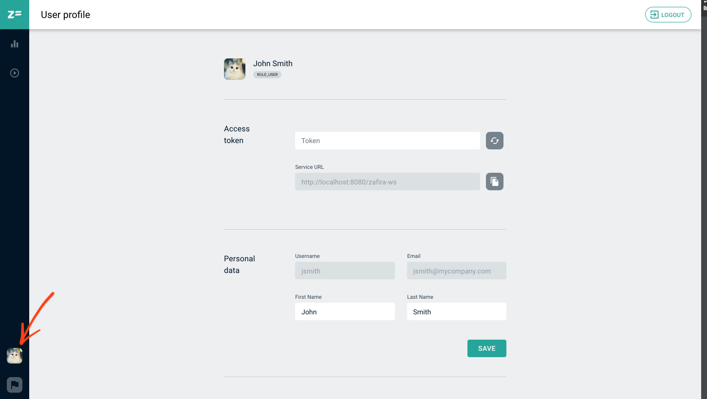

# Profile

Click profile icon in lower left corner of the page to open your **User profile**.

  

If you are willing to change the profile photo, navigate to the same icon on your profile page to upload it.

In **Personal data** area is displayed user personal information. *Username* and *Email* both are set on thr profile creation and cannot be changed, *First Name* and *Last Name* are editable.

In **Access token** area integration data could be obtained. Copy *Service URL* and *Access token* (previously generated) to get integrated with Zafira.

  

In **Change password** area there are fields for the current password update. The new password must contain not less than 5 characters, which could be letters, numbers, special symbols.
